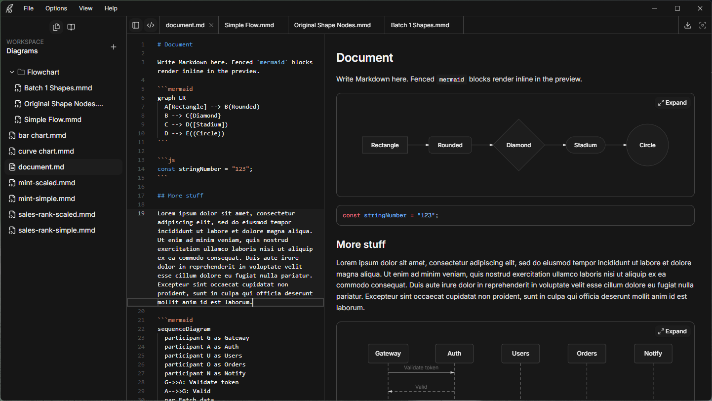

# Scrivon

[](https://github.com/Jamie-Fairweather/scrivon/releases/latest)
[](https://github.com/Jamie-Fairweather/scrivon/actions/workflows/ci.yml)
[](https://codecov.io/gh/Jamie-Fairweather/scrivon/tree/dev)
[](LICENSE)
[](https://github.com/Jamie-Fairweather/scrivon/releases/latest)

**Mermaid & markdown on your machine.**

Scrivon is a desktop editor for [Mermaid](https://mermaid.js.org/) diagrams and Markdown documents. Open a folder on disk, edit `.mmd` or `.md` files with syntax highlighting, and preview diagrams or rendered Markdown live — no account, no cloud workspace required.

<p align="center">
  
</p>

## Features

### Workspaces & files

- **Folder workspaces** — Open any directory on disk; your files never leave your machine
- **File explorer** — Create, rename, duplicate, and delete `.md`, `.mmd`, `.mermaid` files and folders from the sidebar
- **Multi-tab editing** — Work across several documents in one session; tab state is restored per workspace
- **Recent folders** — Quick access from the welcome screen and **File → Open Recent**

### Mermaid diagrams

- **Dedicated diagram files** — Edit standalone `.mmd` / `.mermaid` sources with a split editor and canvas preview
- **Canvas tools** — Pan and zoom the preview, fit diagram to screen, or switch to preview-only layout
- **Diagram export** — Save the active diagram as SVG or PNG (1×, 2×, or 4×)

### Markdown documents

- **Live Markdown preview** — [GFM](https://github.github.com/gfm/)-style rendering beside the editor (tables, task lists, strikethrough, and more)
- **Syntax-highlighted code** — Fenced code blocks use [Shiki](https://shiki.style/) themes that follow your UI light/dark mode
- **Embedded Mermaid** — `mermaid` fenced blocks render inline; expand any block to the full canvas for pan, zoom, and export
- **PDF export** — Save the full rendered document as PDF (native export on Windows via WebView2)

### General

- **Built-in examples** — Curated sample diagrams and a Markdown syntax showcase to explore features
- **Themes** — Light and dark UI plus 15+ diagram palettes (Scrivon, Zinc, Tokyo Night, Catppuccin, Nord, Dracula, GitHub, Solarized, One Dark, and more)
- **Autosave** — Optional autosave to disk; **Ctrl/Cmd+S** saves immediately
- **Desktop-native** — Built with [Tauri 2](https://v2.tauri.app/) for a fast, local-first experience on Windows
- **Auto-updates** — Stable releases can update in-app (see [releases](https://github.com/Jamie-Fairweather/scrivon/releases))

> Scrivon is an independent editor. It is not affiliated with Mermaid Chart Inc. or the mermaid-js project.

## Download

Pre-built installers are published on **[GitHub Releases](https://github.com/Jamie-Fairweather/scrivon/releases)**.

| Channel     | Branch | Notes                                                |
| ----------- | ------ | ---------------------------------------------------- |
| Stable      | `main` | Recommended for everyday use; in-app updates enabled |
| Pre-release | `rc`   | Test builds; install manually from Releases          |

## Getting started

### Use a release

1. Download the latest installer from [Releases](https://github.com/Jamie-Fairweather/scrivon/releases).
2. Launch Scrivon and choose **Open Folder**.
3. Select a directory containing `.md` and/or `.mmd` files.
4. Edit in the center pane; the preview updates as you type.
    - **Diagram files** — Preview renders on the canvas.
    - **Markdown files** — Preview shows rendered Markdown; use **Expand** on a `mermaid` block to open it on the canvas.

### Build from source

**Prerequisites:** [Bun](https://bun.sh/), [Rust](https://www.rust-lang.org/tools/install), and platform dependencies for [Tauri](https://v2.tauri.app/start/prerequisites/).

```bash
git clone https://github.com/Jamie-Fairweather/scrivon.git
cd scrivon
bun install
bun run tauri dev
```

For release builds, signing keys, branch workflow, and semantic-release setup, see **[docs/development.md](docs/development.md)**.

## Tech stack

| Layer              | Technologies                                                                                                       |
| ------------------ | ------------------------------------------------------------------------------------------------------------------ |
| Desktop shell      | [Tauri 2](https://v2.tauri.app/) (Rust)                                                                            |
| UI                 | [Next.js](https://nextjs.org/), [React 19](https://react.dev/)                                                     |
| Editor             | [Monaco](https://microsoft.github.io/monaco-editor/)                                                               |
| Diagram rendering  | [beautiful-mermaid](https://github.com/lukilabs/beautiful-mermaid)                                                 |
| Markdown rendering | [react-markdown](https://github.com/remarkjs/react-markdown), [remark-gfm](https://github.com/remarkjs/remark-gfm) |
| Code highlighting  | [Shiki](https://shiki.style/)                                                                                      |
| Styling            | [Tailwind CSS](https://tailwindcss.com/)                                                                           |

## Project layout

```
scrivon/
├── app/                      # Next.js app routes
├── components/studio/        # Editor, canvas, workspace UI
│   └── markdown/             # Markdown preview and embedded diagrams
├── lib/
│   ├── markdown/             # GFM pipeline, Shiki, PDF export HTML
│   └── mermaid/              # Diagram render and export
├── src-tauri/                # Tauri / Rust backend
├── scripts/                  # Build and codegen utilities
└── docs/                     # Maintainer documentation
```

## Contributing

Contributions are welcome. Please open an issue to discuss larger changes before submitting a pull request.

1. Fork the repository and create a branch from `dev` (or `main` for small fixes).
2. Use [Conventional Commits](https://www.conventionalcommits.org/) (`feat:`, `fix:`, etc.) so releases can be automated.
3. Run `bun run tauri dev` locally to verify desktop behavior.
4. Open a pull request with a clear description of the change.

See **[docs/development.md](docs/development.md)** for the full release pipeline, branch model, and updater signing.

## Acknowledgments

- [Mermaid](https://mermaid.js.org/) for the diagram syntax
- Example diagrams adapted from [Craft Mermaid samples](https://agents.craft.do/mermaid)
- UI built with [coss](https://coss.com/ui) / Base UI primitives

## License

Scrivon is released under the [MIT License](LICENSE). Third-party dependencies are listed in-app under **Help → Licences**.

## Links

- [Releases](https://github.com/Jamie-Fairweather/scrivon/releases)
- [Development & releases guide](docs/development.md)
- [Report an issue](https://github.com/Jamie-Fairweather/scrivon/issues)
